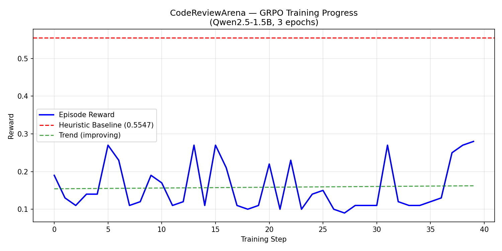

---
title: CodeReviewArena
emoji: 🔍
colorFrom: red
colorTo: blue
sdk: docker
pinned: false
---

# 🔍 CodeReviewArena: Adversarial Multi-Agent Code Review

## 🔗 Links
- **HF Space:** https://huggingface.co/spaces/mkdavboyzz/code_review_arena
- **GitHub:** https://github.com/mkstudioslearncbse-art/code-review-arena
- **API Docs:** https://mkdavboyzz-code-review-arena.hf.space/docs
- **Training Notebook:** https://colab.research.google.com/drive/YOUR_COLAB_ID

## 🎯 Problem
Every day developers push buggy code to production. Human reviewers miss subtle bugs under time pressure. Security vulnerabilities slip through. No RL training environment existed for adversarial code review.

## 🏗️ Environment
- **CodeReviewer agent** reads buggy Python code, retrieves bug patterns via RAG, identifies bug type and proposes fix
- **Hallucination-aware reward** penalizes fake CVE citations (-0.8 penalty)
- **3 difficulty tasks** from obvious bugs to critical security vulnerabilities
- **Self-improving difficulty** escalates as agent improves

## 🤖 Actions
| Action | Description |
|---|---|
| `retrieve` | Look up bug patterns in knowledge base |
| `identify_bug` | Point to bug type and line |
| `propose_fix` | Submit corrected code |
| `escalate` | Flag as critical security issue |

## 🏆 Reward Function
## 📊 Training Results

Trained using GRPO with Unsloth on Qwen2.5-1.5B-Instruct.

## 📈 Baseline Scores (HeuristicAgent, seed=42)
| Task | Score | Pass? |
|---|---|---|
| task1_easy | 0.4988 | ✗ |
| task2_medium | 0.5365 | ✗ |
| task3_hard | 0.6289 | ✅ |
| **Mean** | **0.5547** | — |

## 🎯 Themes
- Theme 1: Multi-Agent Interactions
- Theme 4: Self-Improvement
- Theme 5: Wild Card